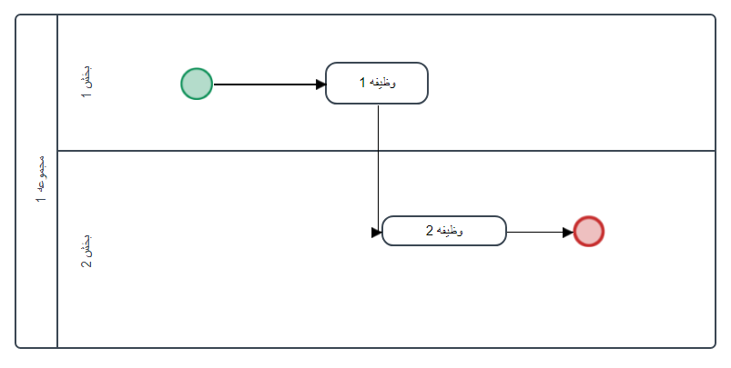

# Coefficient

Calculate the coefficient
# How to calculate the coefficient?

How to calculate the coefficient is very simple formula:

‍‍‍‍‍‍‍‍‍‍‍‍‍‍‍‍`Coefficient * rate = result`

can be
# Abilities
- Name
- Address
- Document
- Rate
- multiple
- Result
